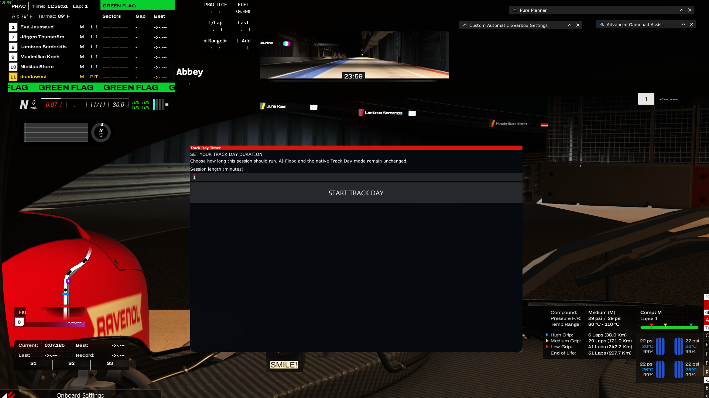

# Assetto Corsa Track Day Session Timer & End Manager

A CSP Lua app for **Assetto Corsa** Track Day. It leaves the original Content Manager, Assetto Corsa
executable, session mode, and CSP AI Flood implementation untouched.

---

## Features

- ⏱️ **In-Game Duration Prompt**: An automatically opened centered setup panel accepts a typed
  duration from 1–180 minutes and focuses the input automatically.
- 📐 **Resizable Setup Panel**: The setup panel can be resized by dragging its edge, with
  sensible minimum and maximum bounds.
- 💾 **Persistent Settings**: Selected session lengths are saved in Content Manager presets and persist across restarts.
- 🚦 **AI Flood Compatibility**: Uses the original Content Manager and preserves native Track Day
  mode selection, CSP, spawn behavior, and AI cars unchanged.
- 🏁 **Session-Over Message**: Displays **`TRACK DAY OVER`** when the app timer expires.
- 🔄 **Lap-Safe End Flow**: After expiry, the app waits for the current lap to finish or for the
  car to enter the pits, then teleports to the pits and ends Assetto Corsa.
- 📌 **Automatic App Opening**: The timer opens automatically when a Track Day starts and is
  positioned beside the native Session Control panel.
- 🕒 **Draggable Timer HUD**: After starting, the setup panel closes automatically and only a
  large text-only timer remains with no surrounding window background. It can be dragged anywhere.

---

## Screenshots

### 1. Track Day Timer Setup
The timer setup screen opens automatically when the Track Day session starts. The minutes field is
focused automatically, so type the desired duration and press **START TRACK DAY** (or Enter):



### 2. In-Game Timer HUD
After starting the session, the setup screen closes and the transparent, draggable timer remains
visible as text only:


---

## Installation

1. Download or clone this private repository.
2. Close Content Manager and Assetto Corsa.
3. Copy the repository's `apps` folder into the Assetto Corsa installation folder, merging it
   with the existing `apps` folder. The default installation path is:
   `C:\Program Files (x86)\Steam\steamapps\common\assettocorsa`
4. Alternatively, run `Patch.bat` as administrator. The current installer installs the CSP Lua
   app and does not patch `Content Manager.exe` or `acs.exe`.
5. Launch the same native **Track Day** configuration that previously worked with AI Flood.
6. Restart Assetto Corsa once after installation so CSP rescans the Lua app manifest.
7. When the session starts, the Track Day Timer setup screen opens automatically and focuses the
   minutes field. Type a value from 1 to 180, then press **START TRACK DAY** or Enter.
8. The setup screen closes and the transparent timer HUD appears. Drag it to the preferred
   position; CSP saves that HUD position for later sessions.

### Requirements

- Assetto Corsa with Custom Shaders Patch Lua apps enabled.
- A CSP version meeting the manifest's `REQUIRED_VERSION` value.
- A native Content Manager Track Day session. Do not use the experimental native Content Manager
  patch, because it changes the session behavior and disables AI Flood.

---

## How It Works

### TrackdayTimer Lua App (CSP)
Custom Shaders Patch runs `apps/lua/TrackdayTimer/` in the background during Track Day sessions:
- Provides an automatically focused in-game minutes field and Start button. Values are clamped to
  1–180 minutes.
- Persists the active timer state with CSP storage, so hiding/restoring apps does not ask for a
  second timer during the same session.
- The timer-start confirmation system message disappears after 5 seconds.
- When the configured time expires, broadcasts **"TRACK DAY OVER"** for 10 seconds and waits for
  the current lap or pit entry before ending the session.
- The app opens itself automatically after a Track Day session starts. Its temporary setup window
  is centered at 900×560, can be resized, and closes after the timer starts. The countdown HUD
  does not override its position, allowing CSP to preserve the last location where you dragged it.
  After starting, the HUD is opened once and is not forced open every frame, allowing CSP's global
  hide/show action to hide and restore it together with the other apps. The controller binding
  shown in the screenshot is a global CSP action; restoration of third-party apps remains managed
  by CSP.
- Timer state is saved with `ac.storage()` and restored when the app is reloaded during the same
  Track Day session. The native session countdown is also stored as a session fingerprint, so
  starting a new Track Day with the same session name does not inherit the previous timer. CSP
  exposes that native countdown in seconds, and a reset upward by more than five seconds marks a
  new session. The selected timer is anchored to that native countdown, so hiding the apps does
  not pause the countdown while the Lua app is temporarily not being updated.
  CSP Lua apps cannot inject controls into the built-in Session Control panel.
- It does not rewrite `race.ini`, change session modes, pause, close the process, alter controls, or
  manipulate AI vehicles.

The app is available after the game session starts; CSP Lua apps cannot add controls to
Content Manager's pre-launch Track Day setup screen. A Content Manager slider requires patching
Content Manager itself, and earlier attempts changed the generated mode and disabled AI Flood.
The native Content Manager timer experiment is not part of the active installation: it disabled
AI Flood and must not be used. The original Content Manager executable is restored, and this app
uses its own timer without changing session mode, `race.ini`, or AI behavior.

---

## How to Uninstall / Restore

Both original files are automatically backed up before any modifications:
- **Restore Content Manager**: Delete `Content Manager.exe` and rename `Content Manager.original.exe` back to `Content Manager.exe`.
- **Restore Engine**: No engine restore is required; This implementation does not modify `acs.exe`. CSP's AI Flood implementation is documented as
Track Day-only; the patch does not try to force Flood into Practice or Qualifying because those
modes use different AI behavior and changing CSP would risk the working baseline.
- **Remove Lua App**: Delete the folder `assettocorsa/apps/lua/TrackdayTimer/`.

---

## Project Structure

```text
assetto-corsa-trackday-timer/
├── apps/
│   └── lua/
│       └── TrackdayTimer/
│           ├── manifest.ini           # CSP Lua app manifest
│           └── TrackdayTimer.lua      # Native countdown expiry notification
├── assets/
│   ├── trackday-timer-setup.png       # Timer duration setup screen
│   └── trackday-timer-hud.png         # Transparent in-game timer HUD
├── diffs/
│   ├── actools_SetSessions.cs         # Code diff for actools.dll
│   └── QuickDrive_Trackday.cs         # Code diff for QuickDrive_Trackday
├── scripts/
│   ├── Patch.ps1                      # Automated compilation & patching script
│   └── verify_patched_cm.ps1          # IL bytecode verification script
├── src/
│   ├── FullPatcher.cs                 # Standalone C# Mono.Cecil patcher tool
│   ├── TrackdayDurationHelper.cs      # UI layout & binding helper
│   ├── actools_patched.dll            # Patched actools assembly
│   ├── actools_compressed.bin         # Deflate-compressed actools resource
│   └── lib/                           # Mono.Cecil & TrackdayHelper assemblies
├── Patch.bat                          # 1-Click installer batch script
└── README.md
```

---

## License

MIT License. Open source for the Assetto Corsa sim racing community.
