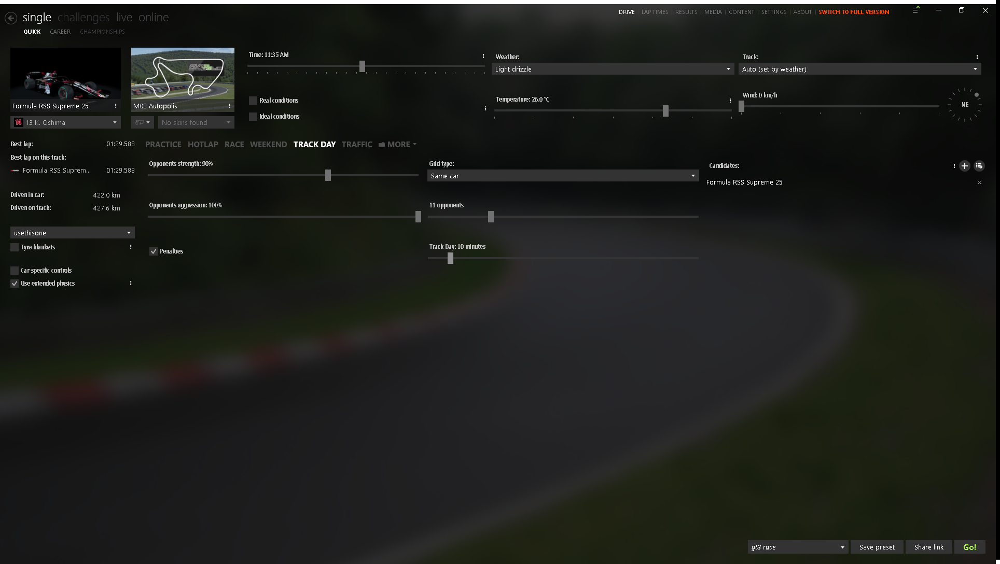
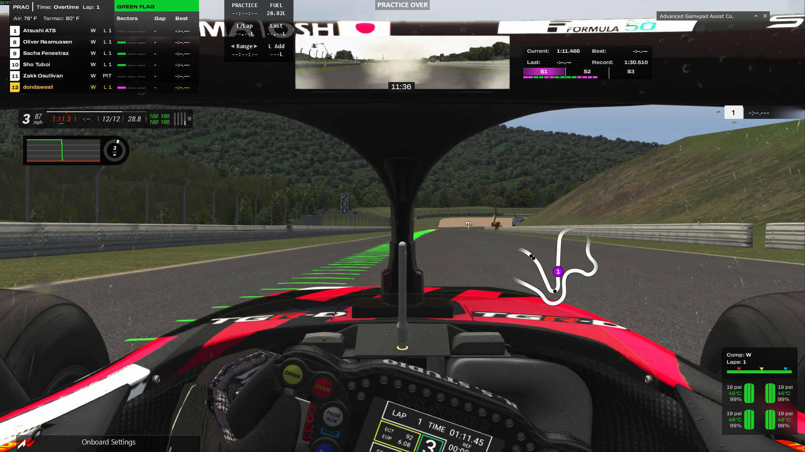

# Assetto Corsa Track Day Session Timer & End Manager

A CSP Lua app for **Assetto Corsa** Track Day. It leaves the original Content Manager, Assetto Corsa
executable, session mode, and CSP AI Flood implementation untouched.

---

## Features

- ⏱️ **In-Game Duration Prompt**: The setup window opens automatically in the center of the
  screen; choose 1–180 minutes and press Start before driving.
- 💾 **Persistent Settings**: Selected session lengths are saved in Content Manager presets and persist across restarts.
- 🚦 **AI Flood Compatibility**: Uses the original Content Manager and preserves native Track Day
  mode selection, CSP, spawn behavior, and AI cars unchanged.
- 🏁 **Session-Over Message**: Displays **`TRACK DAY OVER`** when the app timer expires.
- 🔄 **Lap-Safe End Flow**: After expiry, the app waits for the current lap to finish or for the
  car to enter the pits, then teleports to the pits and ends Assetto Corsa.
- 📌 **Automatic App Opening**: The timer opens automatically when a Track Day starts and is
  positioned beside the native Session Control panel.
- 🕒 **Draggable Timer HUD**: A separate large timer is shown at the top of the screen and can be
  dragged to any position.

---

## Screenshots

### 1. Content Manager Track Day Duration Slider
The new duration slider placed seamlessly under the **Opponents** count in the Track Day settings grid:



### 2. In-Game Session Timer & Overtime Flag
When the configured time expires in-game, Assetto Corsa displays **TRACK DAY OVER** and switches the timer to Overtime:



---

## Installation

### Installation
1. Download or clone this repository.
2. Make sure **Content Manager** and **Assetto Corsa** are closed.
3. Double-click **`Patch.bat`** (or right-click $\rightarrow$ Run as administrator if your game is in Program Files).
4. Copy the repository's `apps` folder into the Assetto Corsa root.
5. Start the same native Track Day configuration that works with AI Flood.
6. Restart Assetto Corsa once after installation so CSP rescans Lua app manifests.
7. The Track Day Timer opens automatically in the center when the session starts. Choose the
   duration and press **Start timer**. A draggable countdown HUD appears at the top.

---

---

## How It Works

### TrackdayTimer Lua App (CSP)
Custom Shaders Patch runs `apps/lua/TrackdayTimer/` in the background during Track Day sessions:
- Provides an in-game duration slider and Start button.
- When the configured time expires, broadcasts **"TRACK DAY OVER"** for 10 seconds and waits for
  the current lap or pit entry before ending the session.
- The app opens itself automatically after a Track Day session starts. Its setup window is centered
  and its separate countdown HUD is draggable. CSP Lua apps cannot inject controls into the
  built-in Session Control panel.
- It does not rewrite `race.ini`, change session modes, pause, close the process, alter controls, or
  manipulate AI vehicles.

The app is available after the game session starts; CSP Lua apps cannot add controls to
Content Manager's pre-launch Track Day setup screen. A Content Manager slider requires patching
Content Manager itself, and earlier attempts changed the generated mode and disabled AI Flood.
The native Content Manager timer experiment is not part of the active installation: it disabled
AI Flood and must not be used. The original Content Manager executable is restored, and this app
uses its own timer without changing session mode, `race.ini`, or AI behavior.

---

## How to Uninstall / Restore

Both original files are automatically backed up before any modifications:
- **Restore Content Manager**: Delete `Content Manager.exe` and rename `Content Manager.original.exe` back to `Content Manager.exe`.
- **Restore Engine**: No engine restore is required; This implementation does not modify `acs.exe`. CSP's AI Flood implementation is documented as
Track Day-only; the patch does not try to force Flood into Practice or Qualifying because those
modes use different AI behavior and changing CSP would risk the working baseline.
- **Remove Lua App**: Delete the folder `assettocorsa/apps/lua/TrackdayTimer/`.

---

## Project Structure

```text
assetto-corsa-trackday-timer/
├── apps/
│   └── lua/
│       └── TrackdayTimer/
│           ├── manifest.ini           # CSP Lua app manifest
│           └── TrackdayTimer.lua      # Native countdown expiry notification
├── assets/
│   ├── cm_trackday_slider.png         # Screenshot of Content Manager UI
│   └── ac_session_over.png            # Screenshot of in-game session over
├── diffs/
│   ├── actools_SetSessions.cs         # Code diff for actools.dll
│   └── QuickDrive_Trackday.cs         # Code diff for QuickDrive_Trackday
├── scripts/
│   ├── Patch.ps1                      # Automated compilation & patching script
│   └── verify_patched_cm.ps1          # IL bytecode verification script
├── src/
│   ├── FullPatcher.cs                 # Standalone C# Mono.Cecil patcher tool
│   ├── TrackdayDurationHelper.cs      # UI layout & binding helper
│   ├── actools_patched.dll            # Patched actools assembly
│   ├── actools_compressed.bin         # Deflate-compressed actools resource
│   └── lib/                           # Mono.Cecil & TrackdayHelper assemblies
├── Patch.bat                          # 1-Click installer batch script
└── README.md
```

---

## License

MIT License. Open source for the Assetto Corsa sim racing community.
